<div align="center">

<h1>Task Manager OG // Linux</h1>
<p><strong>面向 Ubuntu 与 AnduinOS 的原生 GTK 系统监视器</strong></p>
<p>实时观察 CPU、内存、GPU、磁盘、网络、功耗、温度、进程与系统服务。</p>
<p>
  
  
  
  
  
  
  
</p>

</div>

> **非官方社区项目**<br>
> 本项目的视觉与信息架构参考 [Task Manager OG](https://tmog.org/)，代码完全独立实现。它不是 Plummers' Software LLC 发布或认可的 Linux 移植版，也不包含官方应用的源码、商标素材或二进制文件。

<table>
  <tr>
    <td width="50%" align="center"><strong>Dark</strong></td>
    <td width="50%" align="center"><strong>Light</strong></td>
  </tr>
  <tr>
    <td width="50%"><a href="screenshots/summary-dark-latest.png"></a></td>
    <td width="50%"><a href="screenshots/summary-light-latest.png"></a></td>
  </tr>
</table>

> 截图中的主机名、账户名和网络地址已替换为公开演示值；性能数字只是采集瞬间的状态，不代表基准测试结果。点击任意截图可以查看原尺寸。

## 功能总览

| 区域 | 能力 |
| --- | --- |
| **Summary** | CPU、频率、温度、GPU、内存、磁盘、网络、可观测功耗和高 CPU 进程集中展示 |
| **CPU** | 总体与内核时间、P/E 核心识别、逻辑处理器历史、缓存与调度统计；图表可收起并自动重排 |
| **Memory** | 使用量、可用量、提交量、缓存、交换空间、内存压力与组成 |
| **GPU / NPU** | Intel、AMD、NVIDIA 多适配器；NPU 检测和明确的 Provider 可用状态 |
| **Disk / Network** | 磁盘活动与吞吐；网卡链路、地址、累计流量和实时收发曲线 |
| **Energy / Thermals** | 电池或系统输入、Intel RAPL、NVIDIA 功耗，以及 thermal、hwmon、NVIDIA 温度传感器 |
| **Processes** | 全部、当前用户、活动和进程树；搜索、排序、CPU 压力条、I/O、启动时间和信号操作 |
| **System** | 系统身份、XDG 自启动项、用户资源汇总和 systemd 服务状态 |
| **Appearance** | 跟随 AnduinOS/Ubuntu，也可以固定使用深色或 macOS 风格的中性浅色界面 |

## 图示导览

### 1. Summary 总览

Summary 是启动后的全局状态页，适合快速判断当前瓶颈：

- **Live meters**：并排显示 CPU 利用率、CPU 频率、热点温度和 GPU 利用率。
- **CPU Overview**：加高的 60 秒双轴图；左轴显示 `0-100%` CPU 利用率，右轴显示 `0-110 C` 热点温度。
- **Top CPU processes**：列出当前 CPU 活动最高的进程及其内存占用。
- **Memory utilization**：显示使用量、总量、可用、缓存与 Swap。
- **Disks / Network / Energy & Thermals**：底部保留磁盘、网络、功耗和温度的快速状态条。

<a href="screenshots/summary-light-latest.png"></a>

深色和浅色模式使用同一套布局与指标；标题栏按钮、侧栏、表格、卡片、滚动条和自绘图表会一起切换，而不是只替换窗口背景。

第一行按照 TMOG 的信息密度加高，Live meters 的分段柱、CPU 双轴历史和 Top CPU processes 会使用相同高度。CPU 图内绿色与橙色曲线分别使用独立纵轴，底部详情同时保留逻辑处理器、频率、热点温度和 Kernel 百分比。

默认窗口高度按照完整 Summary 的最小内容高度再增加 `10px` 设置；在标准字体与缩放下默认尺寸为 `1240×799`。启动后还会按实际 GTK 字体度量补足少量高度，避免首次打开时 Summary 底部落入滚动区域；屏幕本身高度不足时仍保留外层滚动。

<a href="screenshots/summary-dark-latest.png"></a>

### 2. CPU 与自适应逻辑处理器

CPU 页面从上到下分为四层：当前利用率条、Overall 历史、Logical processors 网格和 Details。每个逻辑处理器都有独立的 60 秒曲线；标题会在内核可识别时标注 P-core 或 E-core。

<a href="screenshots/performance-cpu-latest.png"></a>

图中可以看到：

- Overall 同时绘制总利用率和 Kernel 时间，不把两者误当成独立总量。
- 28 个逻辑处理器根据可用宽度自动计算列数、图块高度与密度。
- Details 卡片按内容自然结束，包含频率、核心数、逻辑处理器数、缓存、Interrupts 和 Context switches。
- Overall 与 Logical processors 的展开/折叠状态会保存在用户设置中，重新启动后自动恢复。
- 页面只有统一的外层滚动，逻辑处理器卡片内部不会再出现遮挡最后一行的滚动条。

Overall 与 Logical processors 都可以单独收起。收起 Overall 后，下面的逻辑处理器区域立即重新计算高度，使用释放出来的空间；Details 会紧接图表结束，不会被空白区域推到窗口底部。

<a href="screenshots/performance-cpu-collapsed-latest.png">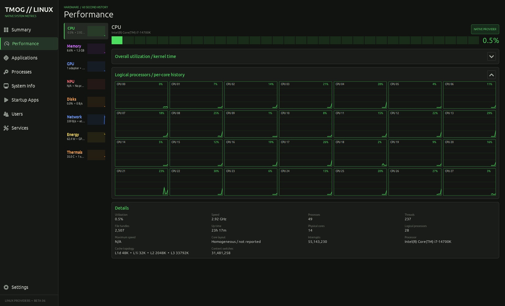</a>

当逻辑处理器数量继续增加或窗口变窄时，布局会依次使用完整、紧凑和数字密度，避免为了维持固定图块尺寸而裁掉最后几颗 CPU。

### 3. Memory 内存

<a href="screenshots/performance-memory-latest.png"></a>

- 主图显示 60 秒内存利用率，并可叠加 Linux PSI memory pressure。
- Memory composition 用分段条直观显示已使用与剩余容量。
- Details 提供 In use、Available、Committed、Cached、Buffers、Active、Inactive、Slab、Shared、Swap 和 Installed。
- 左侧小窗和右侧主图都按 `0-100%` 绘制，历史长度同为 60 个样本，比例不会各算一套。

### 4. GPU 多适配器

<a href="screenshots/performance-gpu-latest.png"></a>

- 多 GPU 设备通过适配器选择器切换，Intel/AMD DRM 与 NVIDIA 可以同时出现。
- NVIDIA 专有驱动存在时使用 `nvidia-smi` 读取利用率、显存、频率、温度、功耗和风扇。
- Intel UHD 等集成显卡使用共享系统内存时会显示 `Shared system memory`，不会伪造独立显存容量。
- Provider 徽标说明数据来源；Details 继续显示驱动、PCI、设备节点与显存模式。

### 5. NPU Provider 状态

<a href="screenshots/performance-npu-latest.png">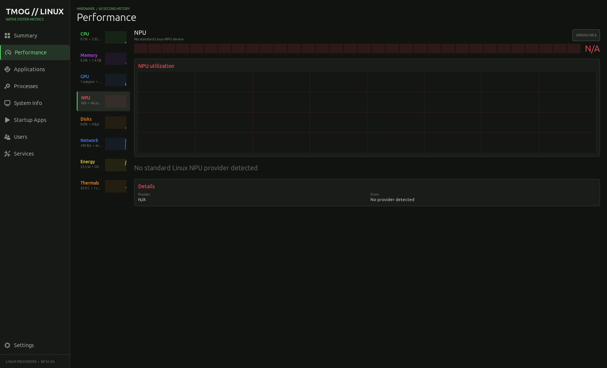</a>

Linux 目前没有覆盖所有 NPU 的统一利用率接口。页面会区分“检测到设备但没有利用率 Provider”和“没有检测到标准 Provider”；无法读取时明确显示 `N/A`，不使用模拟曲线填充空缺。

### 6. Disks 磁盘

<a href="screenshots/performance-disk-latest.png">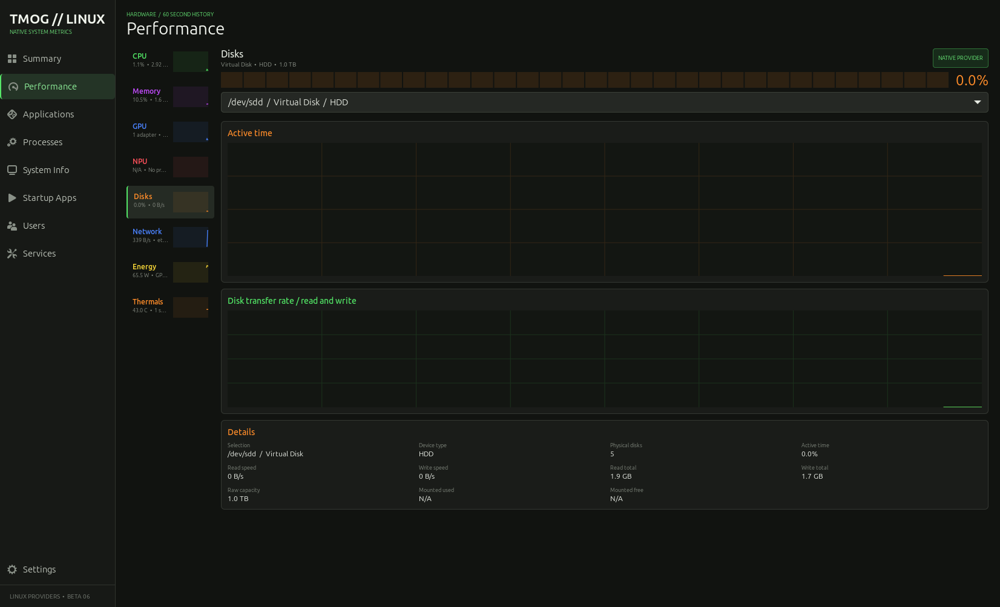</a>

- Active time 汇总物理块设备忙碌百分比。
- 第二张图分别保留读取和写入吞吐历史，便于区分读写峰值。
- Details 显示物理磁盘数量、当前速度、累计读写量以及容量、已用和可用空间。
- 采集会排除 loop、ram 和 zram，避免把镜像挂载或内存块设备计入物理磁盘。

### 7. Network 网络

<a href="screenshots/performance-network-latest.png"></a>

- 上图按收发合计速率自动调整纵轴，下图分别展示 Receive 与 Send。
- 左侧资源小窗和主图共享 60 样本历史及同一自适应峰值余量，因此峰形和比例一致。
- Details 提供主接口、连接类型、Link 状态、链路速率、累计流量、MAC、IPv4/IPv6、MTU 和接口数量。
- 截图使用 RFC 文档专用地址 `192.0.2.10` 与 `2001:db8::10`，不是测试设备的真实地址。

### 8. Energy 可观测功耗

<a href="screenshots/performance-energy-latest.png"></a>

- 优先展示系统输入或电池功耗；不可用时组合 Intel RAPL CPU package 和 NVIDIA device 数据。
- Provider 与 Details 会明确标出测量来源以及 CPU、GPU、System input 各自是否可用。
- 底部进程条表示 **CPU activity**，不是推算出来的每进程瓦数，标题会明确写出 `no per-process power attribution`。
- 只有部件遥测时不会把数值称为墙插端整机功耗。

### 9. Thermals 温度传感器

<a href="screenshots/performance-thermals-latest.png"></a>

- 主图统一按 `0-110 C` 绘制 60 秒热点历史，左侧小窗使用相同比例。
- Details 显示当前热点、传感器数量和 Normal/Warm/Hot 状态。
- 下方按来源列出独立传感器卡片，可同时包含 thermal zone、hwmon 与 NVIDIA GPU。
- WSL、虚拟机或部分主板不暴露温度时，页面会显示 Provider 不可用，而不是固定假值。

### 10. Processes 四种视图

Processes 工具栏在四种模式中共享搜索、计数、Follow selection、End process 和 Force stop。表格可按 PID、名称、用户、状态、CPU、内存、线程、I/O 或启动时间升降序排列，并会在每秒刷新时保留排序、选中进程和滚动位置；Settings 还能切换 CPU 百分比文字与压力条。

右键菜单提供 End process、Force stop、Pause process、Resume process 和 Details。结束与强制停止操作继续显示确认对话框；暂停与继续分别发送 Linux `SIGSTOP` 和 `SIGCONT`。PID 0、PID 1 以及 TMOG 自身受到保护，普通用户也不能绕过 Linux 原有的进程权限。详情页显示父 PID、Swap、累计读写、用户/内核 CPU 时间、命令行和 control group。

#### All processes

显示当前用户可见的全部进程，适合按 CPU、内存或 I/O 寻找系统级负载。命令列会保留实际启动命令，双击进程可以查看更完整的详情。

<a href="screenshots/processes-all-latest.png">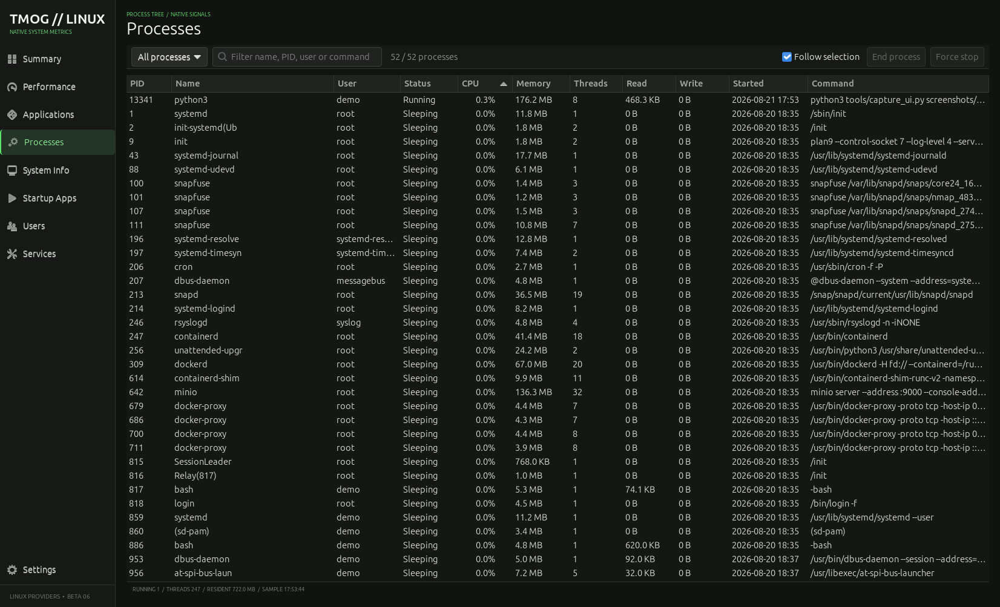</a>

#### My processes

只保留当前登录账户拥有的进程；系统守护进程仍在 All processes 和 Process tree 中，不会混入这个视图。

<a href="screenshots/processes-mine-latest.png">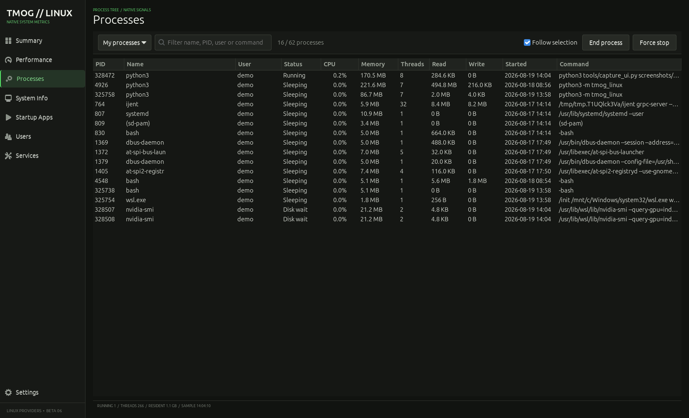</a>

#### Active

显示处于 Running 状态或本次采样 CPU 利用率不低于 `0.1%` 的进程，用于快速缩小排查范围。低负载时列表很短是正常结果，不代表 Provider 没有数据。

<a href="screenshots/processes-active-latest.png">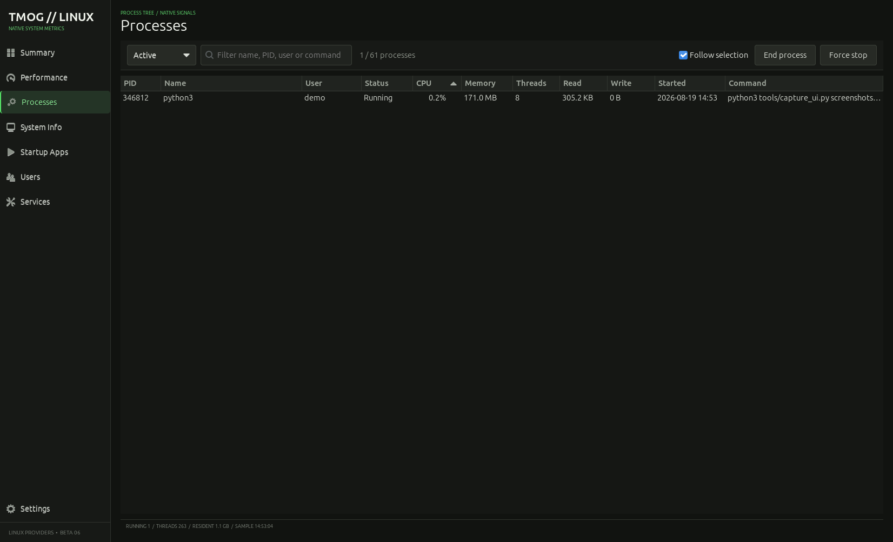</a>

#### Process tree

依据 PPID 建立父子关系并用缩进表达层级；缺失父进程或不可见父进程会作为根节点显示。树模式仍然保留排序、资源列和信号操作。

<a href="screenshots/processes-tree-latest.png"></a>

### 11. System Info 系统信息

<a href="screenshots/system-info-latest.png">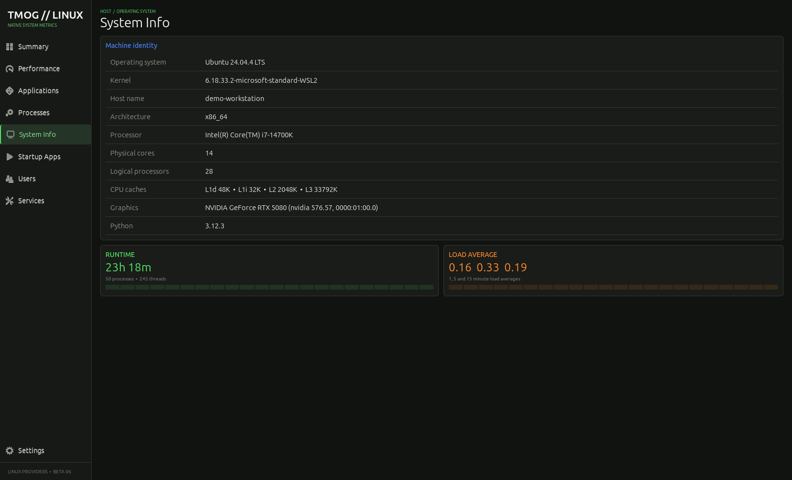</a>

Machine identity 汇总发行版、Kernel、主机名、架构、处理器、物理核心、逻辑处理器、CPU Cache、图形设备和 Python 版本。下方 Runtime 与 Load Average 继续实时更新，方便辨认“运行时间长”与“当前负载高”这两类不同状态。

### 12. Startup Apps 自启动项

<a href="screenshots/startup-apps-latest.png">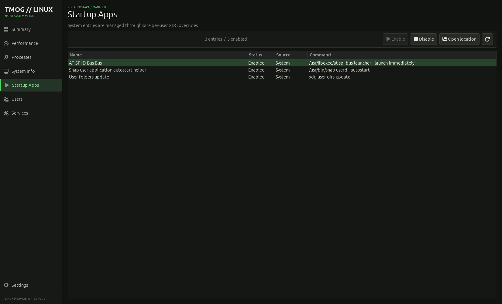</a>

读取系统与当前用户的 XDG autostart 目录，显示名称、启用状态、来源和命令。选择条目后可以启用、禁用或打开配置位置；系统级条目会通过当前用户目录中的 XDG override 管理，不会直接修改 `/etc/xdg/autostart`。

### 13. Users 用户资源汇总

<a href="screenshots/users-latest.png">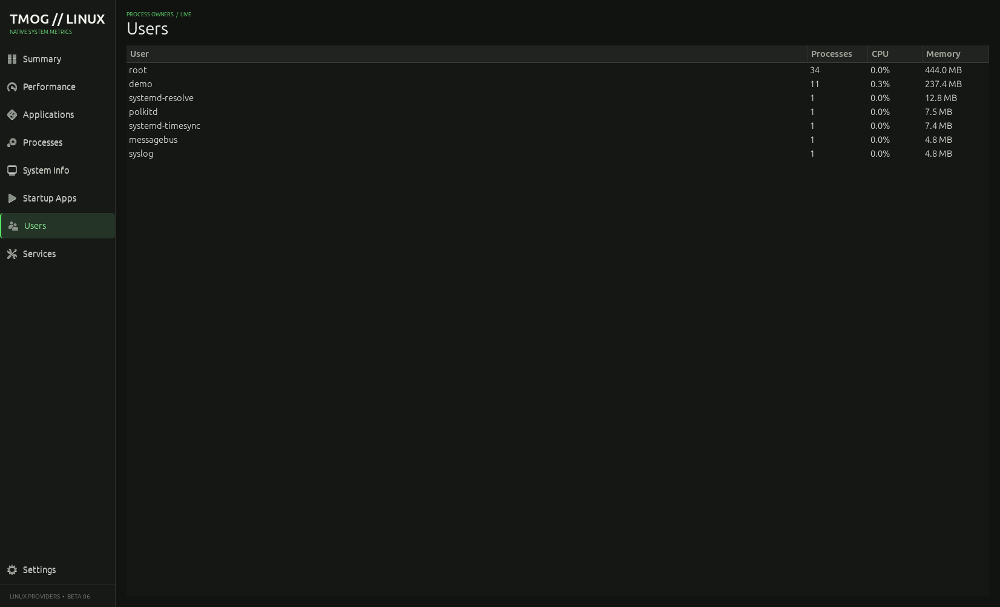</a>

按照进程所有者聚合进程数量、CPU 与常驻内存。它包含 `root` 和 systemd 服务账户，因此可以快速看出资源主要属于登录用户还是系统服务。

### 14. Services systemd 服务

<a href="screenshots/services-latest.png">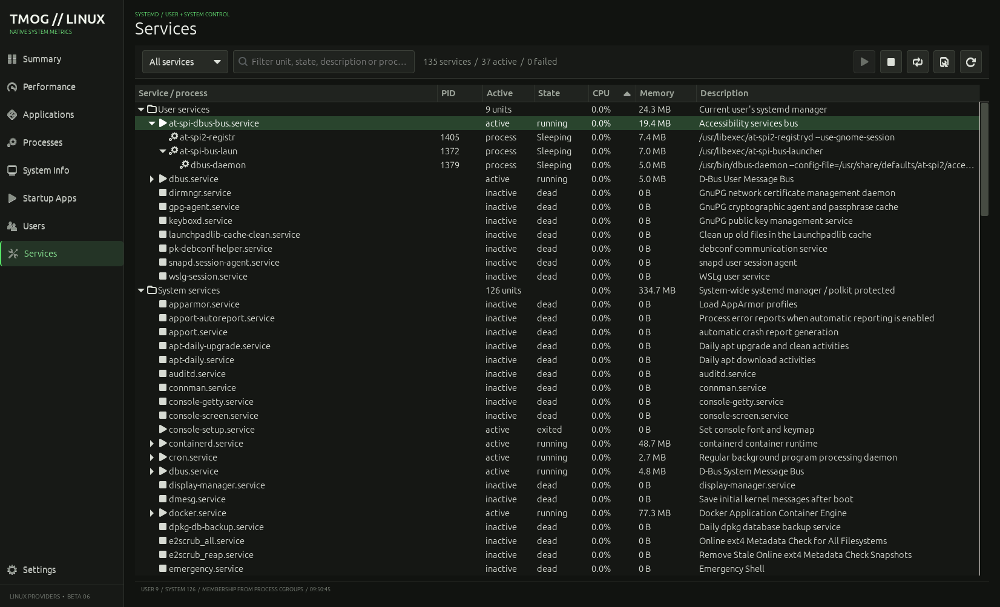</a>

列出 systemd unit 的 Active、State 与 Description。服务列表只在页面初始化时读取一次，避免持续调用 `systemctl` 产生额外负担；当前版本保持只读，服务管理继续交给系统工具。

### 15. Settings 与双主题

Settings 提供三种外观选项：`Follow system`、`Dark` 和 `Light`。Follow system 会跟随 AnduinOS/Ubuntu 的颜色方案；固定模式不受桌面主题变化影响。主题选择以及 CPU 的 Overall、Logical processors 展开状态都会保存在 `~/.config/tmog-linux/settings.ini`。

<table>
  <tr>
    <td width="50%" align="center"><strong>macOS 风格中性浅色</strong></td>
    <td width="50%" align="center"><strong>TMOG 深色</strong></td>
  </tr>
  <tr>
    <td width="50%"><a href="screenshots/settings-light-latest.png">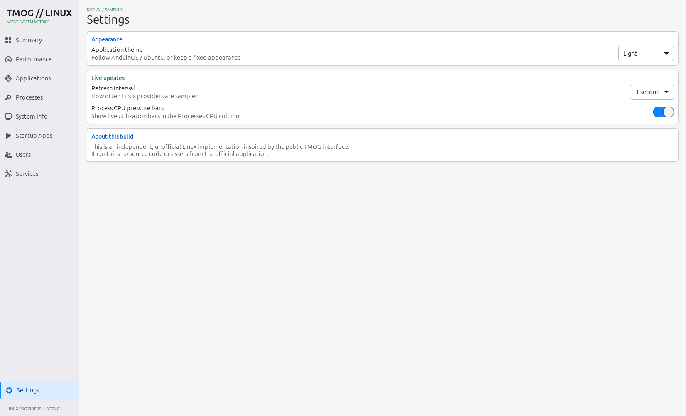</a></td>
    <td width="50%"><a href="screenshots/settings-dark-latest.png">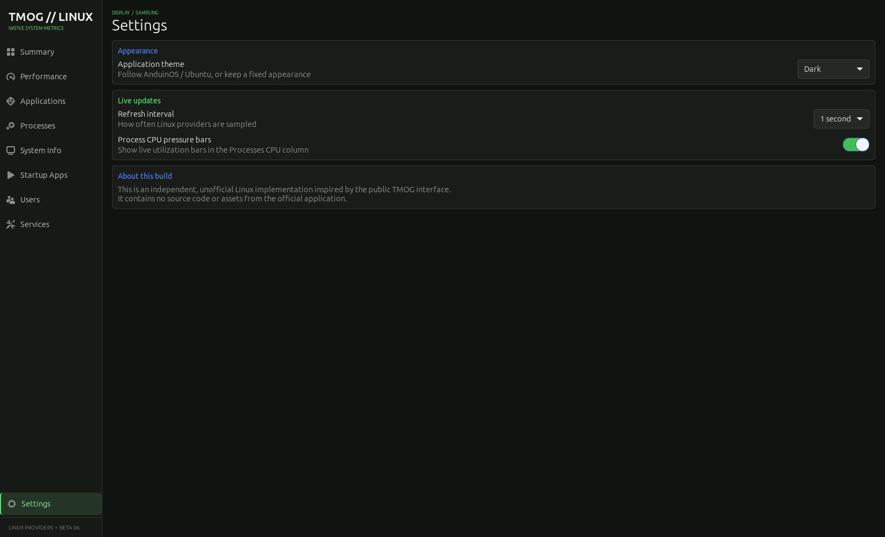</a></td>
  </tr>
</table>

同一页面还可以调整 1、2 或 5 秒采样间隔，并开关 Processes CPU pressure bars。About this build 会明确说明本项目是独立、非官方实现。

## 图表比例规则

Performance 左侧小窗与右侧主图使用相同的 60 样本历史和纵轴：

| 资源 | 纵轴规则 |
| --- | --- |
| CPU、Memory、GPU、Disk | 固定 `0-100%` |
| Thermals | 固定 `0-110 C` |
| Network | 收发合计速率共享自适应峰值余量 |
| Energy | 可观测功耗共享自适应峰值余量 |

因此小窗不会把较低的内存占用或正常温度错误放大到接近满幅，也不会出现侧栏和主图峰形完全对不上的情况。

## 快速开始

支持 Ubuntu 22.04、Ubuntu 24.04、AnduinOS，以及提供 GTK 3 的兼容 Linux 桌面。无需创建 Python 虚拟环境，也不需要执行 `pip install`。

```bash
sudo apt update
sudo apt install -y \
  python3 python3-gi python3-gi-cairo python3-cairo gir1.2-gtk-3.0

cd task-manager-og-linux
chmod +x run.sh install.sh uninstall.sh
./run.sh
```

### 安装到应用菜单

```bash
./install.sh
```

安装范围仅为当前用户。完成后可以从应用菜单打开 `Task Manager OG // Linux`，也可以运行：

```bash
tmog-linux
```

卸载时运行：

```bash
./uninstall.sh
```

## 原生数据来源

核心指标直接读取 Linux 的 `/proc`、`/sys` 和 ioctl，不依赖 `psutil`。

| 指标 | 主要来源 |
| --- | --- |
| CPU、内存、进程 | `/proc/stat`、`/proc/meminfo`、`/proc/[pid]` |
| 磁盘 | `/proc/diskstats`、`/sys/block`；排除 loop、ram 和 zram |
| 网络 | `/proc/net/dev`、`/proc/net/if_inet6`、sysfs 与 Linux ioctl |
| Intel / AMD GPU | DRM sysfs、客户端 DRM `fdinfo`、`gpu_busy_percent` |
| NVIDIA GPU | 驱动附带的 `nvidia-smi` |
| 温度 | `/sys/class/thermal`、`/sys/class/hwmon`、`nvidia-smi` |
| 功耗 | 电池或系统输入遥测、Intel RAPL、NVIDIA 设备功耗 |
| 服务与自启动 | systemd、系统和用户 XDG autostart 目录 |

## 硬件数据说明

- 不同内核、驱动和固件暴露的数据不同；不可读取的指标会明确显示 `N/A`，不会用推算值冒充传感器数据。
- Intel 核显与 NVIDIA 独显可以同时出现在 GPU 选择器中。NVIDIA 详细指标需要可工作的专有驱动和 `nvidia-smi`。
- 功耗可能只覆盖可观测部件。当只有 CPU package 或 GPU device 数据时，界面会标明来源。
- 虚拟机、WSL 或部分主板可能不提供完整温度、电池、风扇、NPU 或 CPU package 功耗数据。

## 权限与安全

- 普通用户只能控制自己有权限操作的进程。
- PID 1 与监视器自身受到保护，不能从界面结束。
- 不建议使用 `sudo ./run.sh` 启动整个界面。管理系统服务时请继续使用 `systemctl` 或系统自带工具。
- Services 当前保持只读；Startup Apps 仅管理 XDG 桌面自启动条目，不修改 systemd 服务。

## 开发与验证

```bash
python3 -m compileall -q tmog_linux tests tools
python3 -m unittest discover -s tests -v
```

项目入口是 `python3 -m tmog_linux`：

- `tmog_linux/app.py`：GTK 界面与响应式布局
- `tmog_linux/metrics.py`：Linux 指标采集与解析
- `tests/`：指标解析与外观配置测试
- `tools/capture_ui.py`：README 截图、公开信息替换与界面几何验证

生成可公开发布的截图时设置 `TMOG_CAPTURE_PUBLIC=1`，工具会把主机名、当前账户、采集路径和网络地址替换为演示值。

## License

独立实现部分以 [MIT License](LICENSE) 发布。Task Manager OG 名称及原项目相关权利归各自权利人所有。
