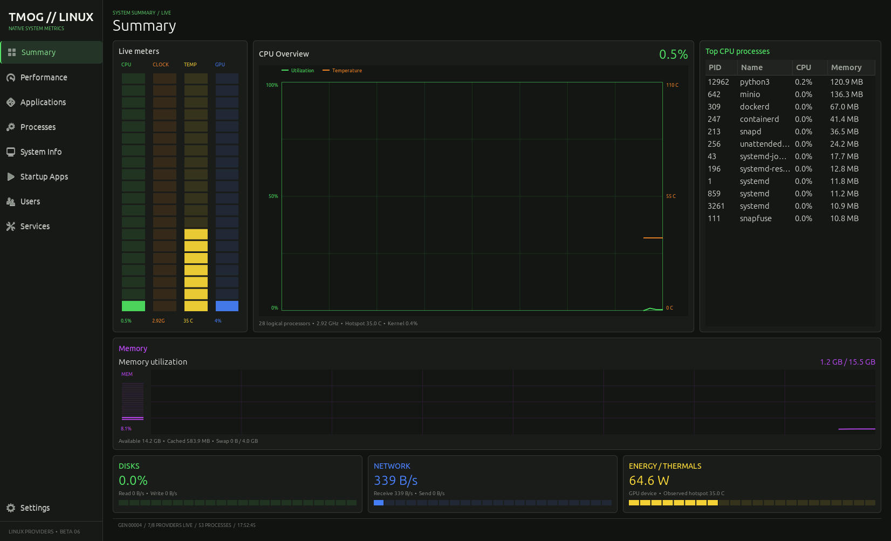
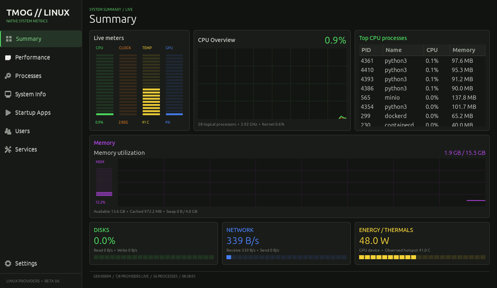
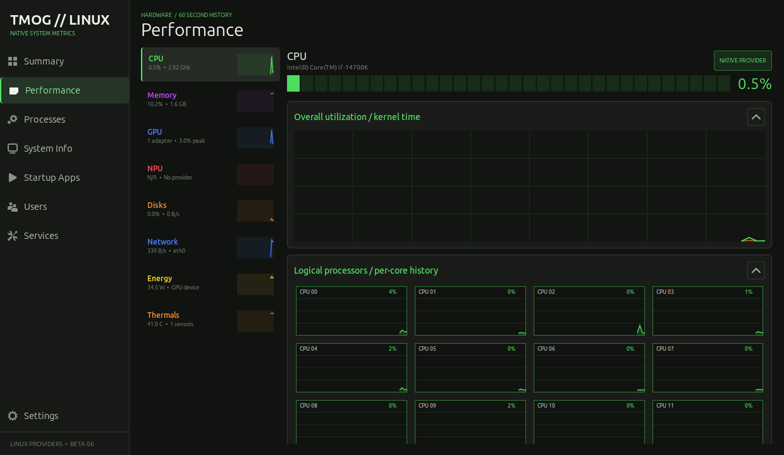
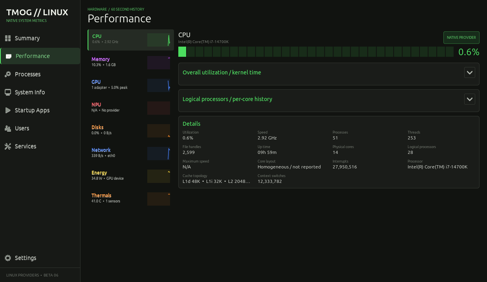
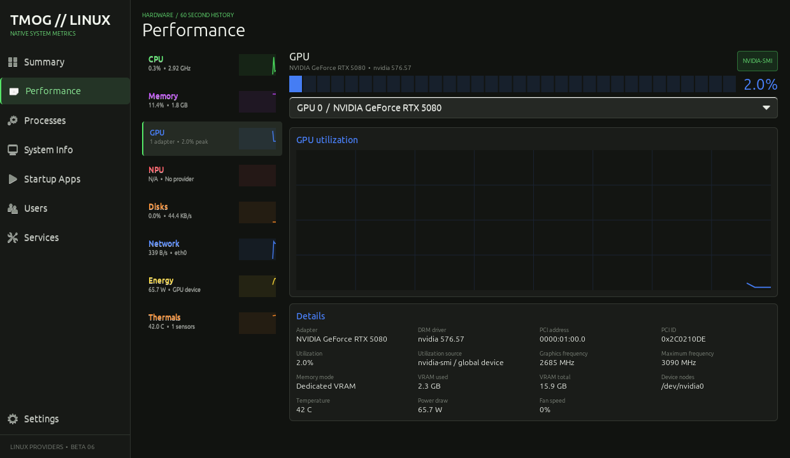
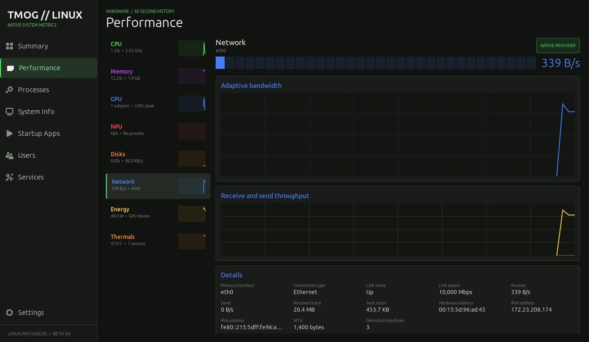
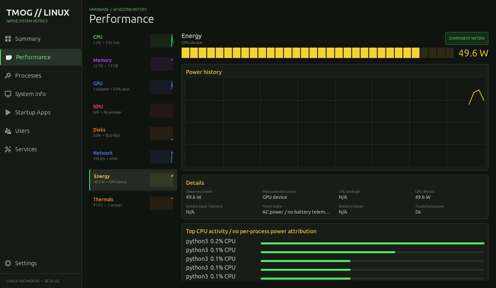
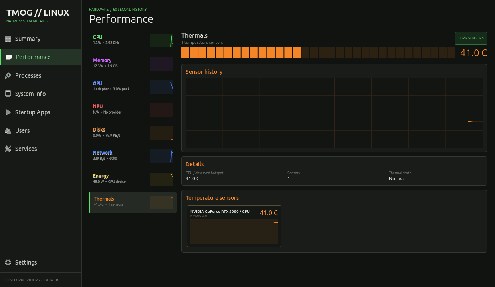
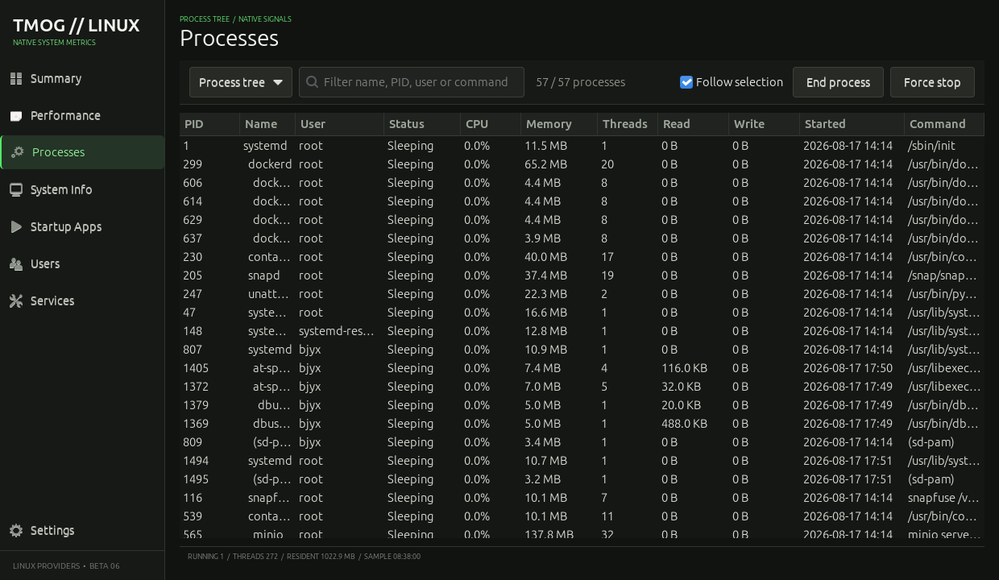

# Task Manager OG // Linux

一个面向 Ubuntu 的原生 GTK 系统监视器，视觉与信息架构参考了 [TMOG](https://tmog.org/)，代码完全独立实现。

> 这是非官方社区版本，不是 Plummers' Software LLC 发布或认可的 Linux 移植版。项目不包含官方应用的源码、商标素材或二进制文件。



## 已实现

- Summary 驾驶舱：CPU、频率、温度、GPU、内存、磁盘、网络和电源实时状态
- Performance：八类资源缩略曲线、分段实时表、P/E 核心分核历史、内存组成、磁盘/网络双曲线、多 GPU 选择器及硬件明细；CPU 总览和逻辑处理器区块可独立收起
- Network：显示主接口、连接类型、链路状态、MAC、IPv4/IPv6、MTU、链路速度和累计流量
- Thermals：保留 thermal zone、hwmon 与 NVIDIA 的每个温度传感器，并分别显示实时历史
- Processes：全部/当前用户/活动/进程树视图、搜索、排序、跟随选择、可切换 CPU 压力条、I/O 与启动时间、双击详情，以及原生信号操作
- System Info：Ubuntu、内核、CPU、架构、运行时间和系统负载
- Startup Apps：读取系统与用户的 XDG 自启动项
- Users：按进程所有者汇总 CPU、内存和进程数
- Services：读取 systemd 服务状态
- 1、2、5 秒采样间隔

## 界面预览

<table>
  <tr>
    <td width="50%"><strong>Summary</strong><br></td>
    <td width="50%"><strong>CPU / logical processors</strong><br></td>
  </tr>
  <tr>
    <td width="50%"><strong>CPU / collapsed sections</strong><br></td>
    <td width="50%"><strong>NVIDIA GPU</strong><br></td>
  </tr>
  <tr>
    <td width="50%"><strong>Network</strong><br></td>
    <td width="50%"><strong>Energy</strong><br></td>
  </tr>
  <tr>
    <td width="50%"><strong>Thermals</strong><br></td>
    <td width="50%"><strong>Process tree</strong><br></td>
  </tr>
</table>

核心指标直接读取 Linux 的 `/proc` 与 `/sys`，不依赖 `psutil`。启用 NVIDIA 专有驱动数据时会调用驱动自带的 `nvidia-smi`；systemd 服务只在启动时读取一次。

## Ubuntu 直接试用

支持 Ubuntu 22.04、24.04 及更新版本的 GNOME/X11/Wayland 桌面。

```bash
sudo apt update
sudo apt install -y python3 python3-gi python3-gi-cairo python3-cairo gir1.2-gtk-3.0

cd task-manager-og-linux
chmod +x run.sh install.sh uninstall.sh
./run.sh
```

不需要建立 Python 虚拟环境，也不需要执行 `pip install`。

## 安装到应用菜单

```bash
./install.sh
```

安装范围仅为当前用户。完成后可以从 Ubuntu 应用菜单打开 `Task Manager OG // Linux`，也可以在终端运行：

```bash
tmog-linux
```

卸载：

```bash
./uninstall.sh
```

## 权限说明

- 普通用户只能结束自己有权限控制的进程。
- PID 1 和监视器自身会被保护，不能从界面结束。
- 不建议用 `sudo ./run.sh` 启动整个界面。需要管理系统服务时继续使用 `systemctl` 或 Ubuntu 自带的管理工具。
- Services 与 Startup Apps 当前为只读，避免监视器意外修改系统启动状态。

## 硬件数据可用性

不同内核和驱动暴露的数据并不相同：

- CPU 与主板温度来自 `/sys/class/thermal` 和 `/sys/class/hwmon`；页面会保留每个可读传感器。虚拟机、WSL 或部分主板可能不提供。
- GPU 型号、驱动、PCI 地址、频率和 Render 节点来自 DRM/sysfs。AMD 优先读取 `gpu_busy_percent`；Intel `i915`/`xe` 会读取可访问客户端的 DRM `fdinfo` 忙碌计数，并明确标注数据范围。
- Intel UHD 集成显卡使用共享系统内存，因此不会伪造 VRAM 容量；页面会显示 `Shared system memory`。
- NVIDIA 专有驱动通过随驱动安装的 `nvidia-smi` 读取每张独显的利用率、显存、频率、温度、功耗和风扇。Intel 核显与 NVIDIA 独显会同时出现在 GPU 选择器中。
- 功耗优先使用电池/系统输入遥测；台式机还会读取 Intel RAPL 的 CPU package 功耗，并合计 `nvidia-smi` 返回的 NVIDIA 设备功耗。
- 当只有 CPU/GPU 分项可用时，界面会标为 `CPU package + GPU device`。这个数值是可观测部件之和，不会冒充墙插端的整机功耗。
- Network 的地址与接口信息来自 sysfs、Linux ioctl 和 `/proc/net/if_inet6`。
- 磁盘统计聚合 `/sys/block` 中的物理设备，并排除 loop、ram 和 zram 设备。

这些指标缺失时界面会显示 `N/A`，其他监控功能仍可正常工作。

## 开发检查

解析器测试不需要 GTK，因此可以单独运行：

```bash
python3 -m unittest discover -s tests -v
python3 -m compileall -q tmog_linux tests
```

项目入口是 `python3 -m tmog_linux`，采集器位于 `tmog_linux/metrics.py`，GTK 界面位于 `tmog_linux/app.py`。
