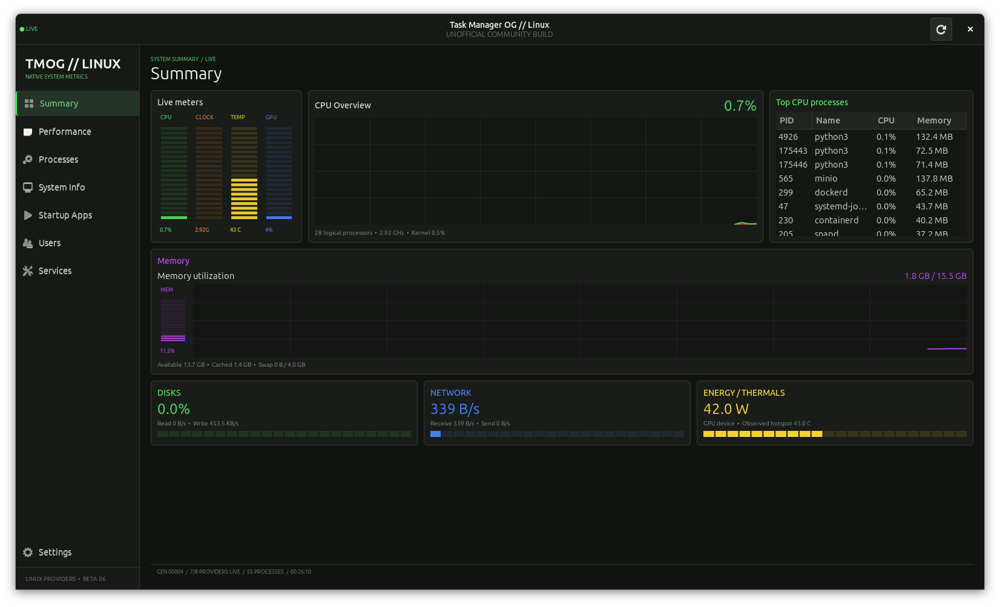
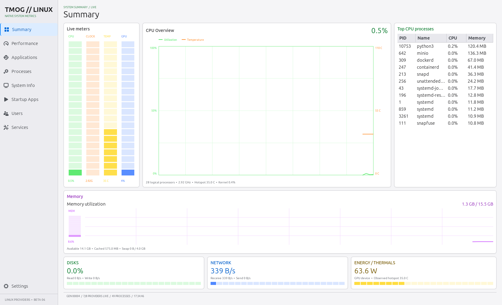
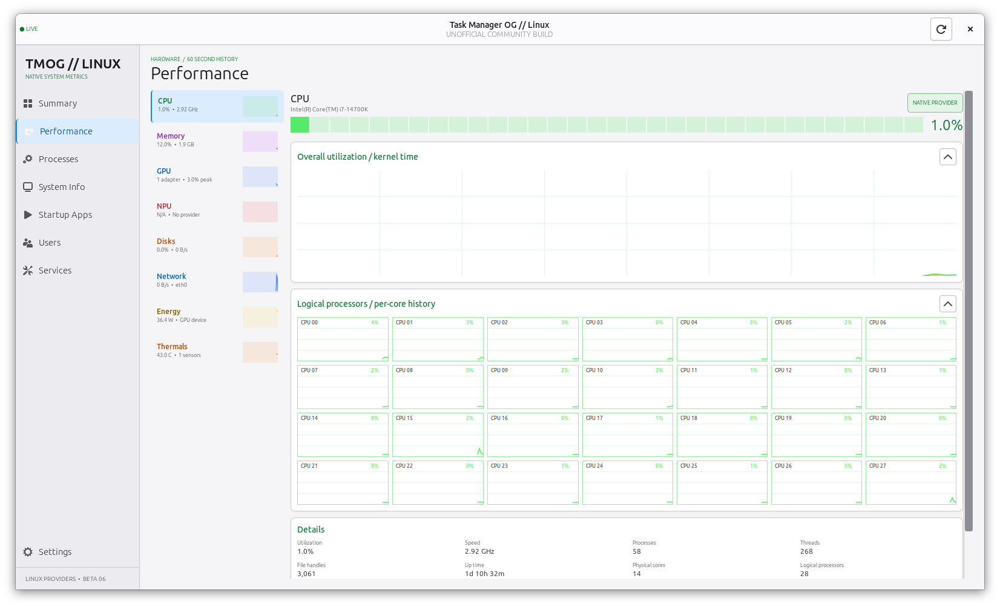
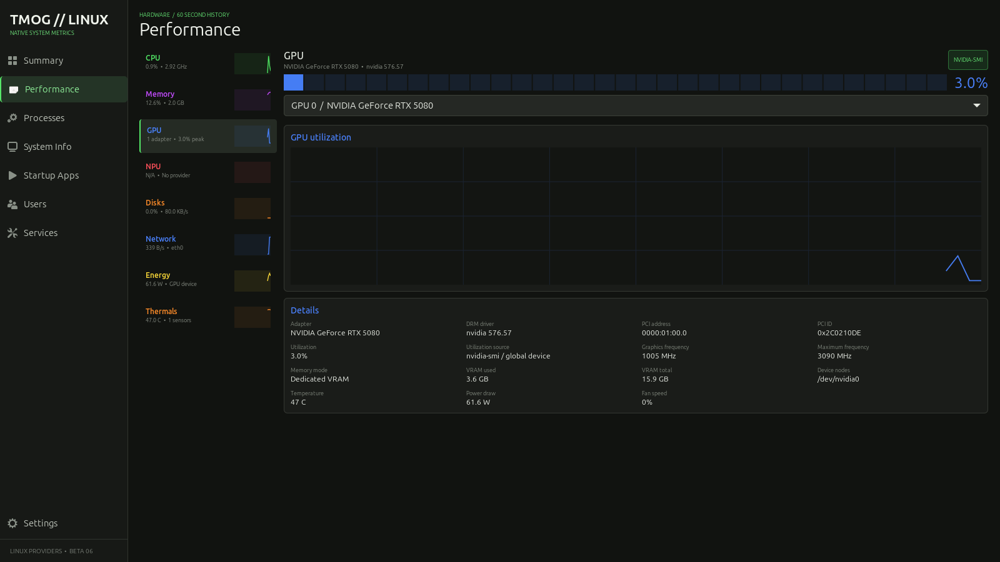
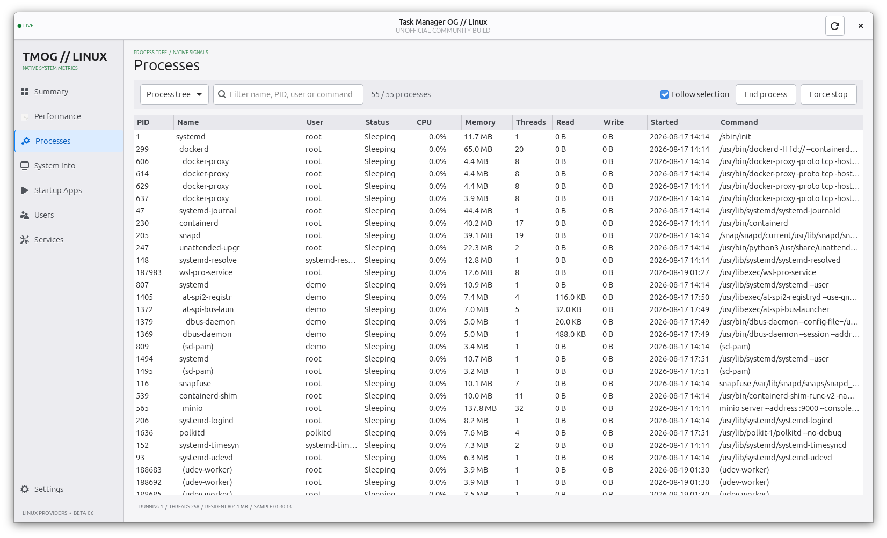
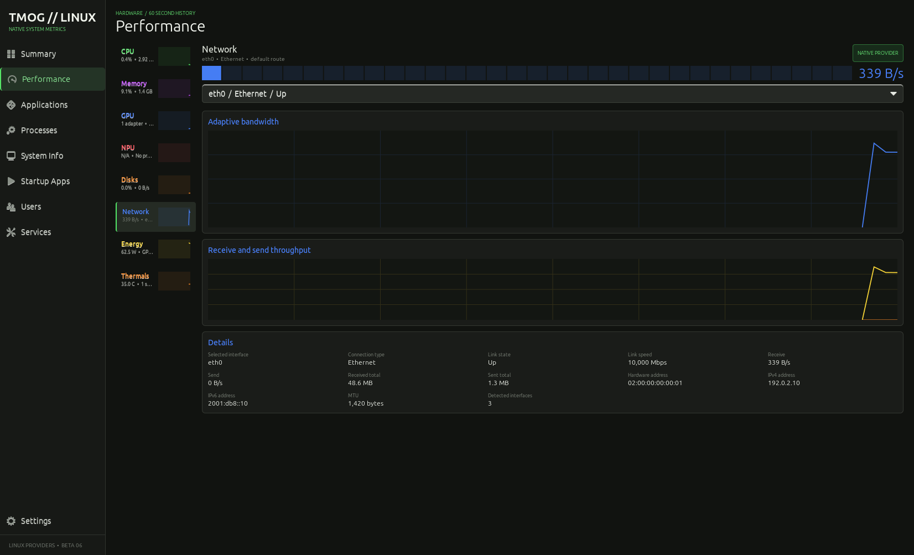
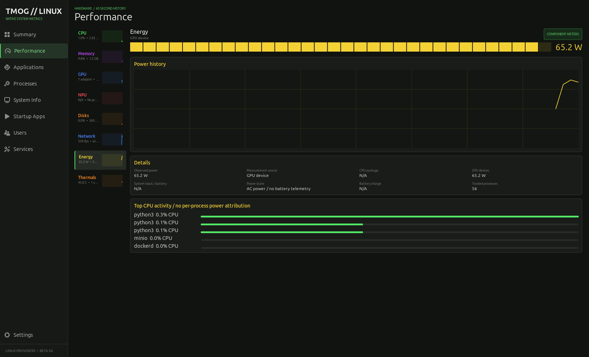
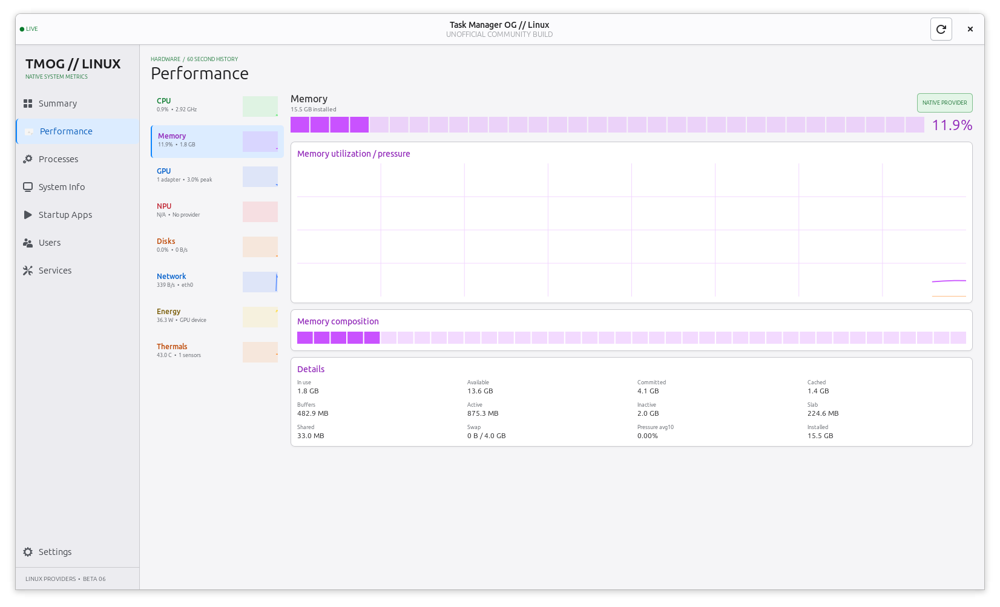
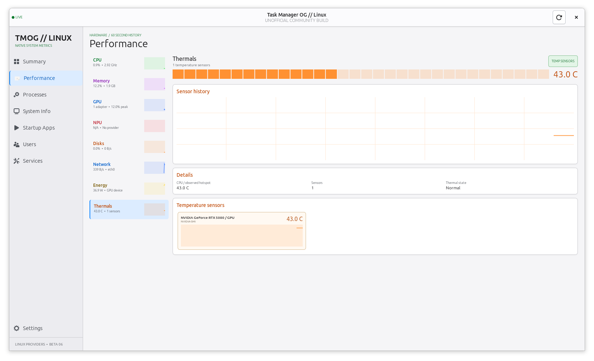

<div align="center">

<h1>Task Manager OG // Linux</h1>
<p><strong>面向 Ubuntu 与 AnduinOS 的原生 GTK 系统监视器</strong></p>
<p>实时观察 CPU、内存、GPU、磁盘、网络、功耗、温度、进程与系统服务。</p>
<p>
  
  
  
  
  
  
  
</p>

</div>

> **非官方社区项目**  
> 本项目的视觉与信息架构参考 [Task Manager OG](https://tmog.org/)，代码完全独立实现。它不是 Plummers' Software LLC 发布或认可的 Linux 移植版，也不包含官方应用的源码、商标素材或二进制文件。

<table>
  <tr>
    <td width="50%" align="center"><strong>Dark</strong></td>
    <td width="50%" align="center"><strong>Light</strong></td>
  </tr>
  <tr>
    <td width="50%"></td>
    <td width="50%"></td>
  </tr>
</table>

## 功能亮点

| 区域 | 能力 |
| --- | --- |
| **Summary** | CPU、频率、温度、GPU、内存、磁盘、网络和可观测功耗集中展示 |
| **CPU** | 总体与内核时间曲线、P/E 核心识别、逻辑处理器历史；按窗口大小在完整、紧凑和数字视图间自动调整 |
| **GPU** | Intel、AMD 与 NVIDIA 适配器；多 GPU 选择器、利用率、显存、频率、温度、功耗和风扇 |
| **Network** | 主接口、连接类型、链路状态、速率、MAC、IPv4/IPv6、MTU、累计流量与收发曲线 |
| **Energy / Thermals** | 电池或系统输入、Intel RAPL、NVIDIA 设备功耗，以及 thermal、hwmon、NVIDIA 独立传感器历史 |
| **Processes** | 全部、当前用户、活动和进程树视图；搜索、排序、CPU 压力条、I/O、启动时间、详情和信号操作 |
| **System** | 系统信息、XDG 自启动项、用户资源汇总和 systemd 服务状态 |
| **Appearance** | 跟随 AnduinOS/Ubuntu 系统主题，也可以固定使用深色或浅色；标题栏、表格与自绘图表同步切换 |

CPU 总览与逻辑处理器区域可以分别收起。收起 Overall 后，逻辑处理器网格会立即重新计算布局并切换到更高的图表；外层页面负责统一滚动，不会再产生遮挡观察内容的内层滚动条。

Performance 左侧资源小窗与右侧主图使用相同的 60 样本历史和纵轴：CPU、Memory、GPU、Disk 固定为 `0-100%`，Thermals 固定为 `0-110 C`；Network 与 Energy 使用相同的自适应峰值余量。因此小窗不再把 35% 内存或 60 C 温度错误放大到接近满幅。

## 深浅主题

`Settings > Appearance` 提供三种应用主题：

| 选项 | 行为 |
| --- | --- |
| **Follow system** | 默认选项；跟随 AnduinOS/Ubuntu 的系统外观，系统主题变化后应用自动重绘 |
| **Dark** | 固定使用 TMOG 深色监控界面，不受系统浅色样式影响 |
| **Light** | 固定使用高对比中性白界面，采用冷灰层级与蓝色选中状态 |

深浅模式不仅切换窗口背景，也会同步更新标题栏按钮、侧栏、卡片、表格、滚动条以及 CPU/GPU 等自绘图表。用户选择保存在 `~/.config/tmog-linux/settings.ini`，重新启动后继续生效。

## 最新界面

<table>
  <tr>
    <td width="50%"><strong>自适应 CPU 网格</strong><br></td>
    <td width="50%"><strong>NVIDIA GPU / nvidia-smi</strong><br></td>
  </tr>
  <tr>
    <td colspan="2"><strong>Process tree</strong><br></td>
  </tr>
</table>

<details>
<summary><strong>查看更多 Performance 页面</strong></summary>
<br>
<table>
  <tr>
    <td width="50%"><strong>Network</strong><br></td>
    <td width="50%"><strong>Energy</strong><br></td>
  </tr>
  <tr>
    <td width="50%"><strong>Memory</strong><br></td>
    <td width="50%"><strong>Thermals</strong><br></td>
  </tr>
</table>
</details>

## 快速开始

支持 Ubuntu 22.04、Ubuntu 24.04、AnduinOS，以及提供 GTK 3 的兼容 Linux 桌面。无需创建 Python 虚拟环境，也不需要执行 `pip install`。

```bash
sudo apt update
sudo apt install -y \
  python3 python3-gi python3-gi-cairo python3-cairo gir1.2-gtk-3.0

cd task-manager-og-linux
chmod +x run.sh install.sh uninstall.sh
./run.sh
```

### 安装到应用菜单

```bash
./install.sh
```

安装范围仅为当前用户。完成后可以从应用菜单打开 `Task Manager OG // Linux`，也可以运行：

```bash
tmog-linux
```

卸载时运行：

```bash
./uninstall.sh
```

## 原生数据来源

核心指标直接读取 Linux 的 `/proc`、`/sys` 和 ioctl，不依赖 `psutil`。

| 指标 | 主要来源 |
| --- | --- |
| CPU、内存、进程 | `/proc/stat`、`/proc/meminfo`、`/proc/[pid]` |
| 磁盘 | `/proc/diskstats`、`/sys/block`；排除 loop、ram 和 zram |
| 网络 | `/proc/net/dev`、`/proc/net/if_inet6`、sysfs 与 Linux ioctl |
| Intel / AMD GPU | DRM sysfs、客户端 DRM `fdinfo`、`gpu_busy_percent` |
| NVIDIA GPU | 驱动附带的 `nvidia-smi` |
| 温度 | `/sys/class/thermal`、`/sys/class/hwmon`、`nvidia-smi` |
| 功耗 | 电池或系统输入遥测、Intel RAPL、NVIDIA 设备功耗 |
| 服务与自启动 | systemd、系统和用户 XDG autostart 目录 |

systemd 服务列表只在启动时读取一次，避免持续扫描产生额外负担。

## 硬件数据说明

- 不同内核、驱动和固件暴露的数据不同；不可读取的指标会明确显示 `N/A`，不会用推算值冒充传感器数据。
- Intel UHD 集成显卡使用共享系统内存，界面会显示 `Shared system memory`，不会伪造独立显存容量。
- Intel 核显与 NVIDIA 独显可以同时出现在 GPU 选择器中。NVIDIA 专有驱动可提供每张独显的利用率、显存、频率、温度、功耗和风扇信息。
- 功耗可能只覆盖可观测部件。当只有 CPU package 或 GPU device 数据时，界面会标明来源，不会将其称为墙插端整机功耗。
- 虚拟机、WSL 或部分主板可能不提供完整温度、电池、风扇或 CPU package 功耗数据。

## 权限与安全

- 普通用户只能控制自己有权限操作的进程。
- PID 1 与监视器自身受到保护，不能从界面结束。
- 不建议使用 `sudo ./run.sh` 启动整个界面。管理系统服务时请继续使用 `systemctl` 或系统自带工具。
- Services 与 Startup Apps 当前保持只读，避免监视器意外修改系统启动状态。

## 开发与验证

```bash
python3 -m compileall -q tmog_linux tests tools
python3 -m unittest discover -s tests -v
```

项目入口是 `python3 -m tmog_linux`：

- `tmog_linux/app.py`：GTK 界面与响应式布局
- `tmog_linux/metrics.py`：Linux 指标采集与解析
- `tests/`：指标解析与外观配置测试
- `tools/capture_ui.py`：README 截图与界面几何验证

## License

独立实现部分以 [MIT License](LICENSE) 发布。Task Manager OG 名称及原项目相关权利归各自权利人所有。
